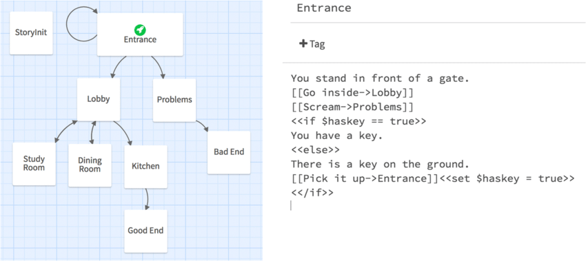
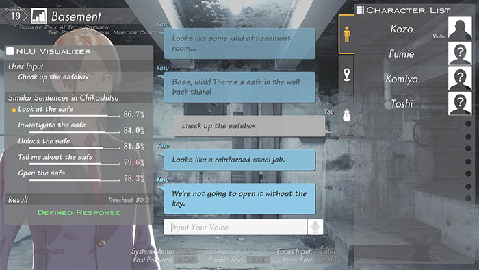



## Are NPCs really talking to you?


> [**"My name is Connor. I'm the android sent by CyberLife."**](https://www.imdb.com/title/tt5158314/quotes/?item=qt4868806) -- Connor in [Detroit: Become Human](https://en.wikipedia.org/wiki/Detroit:_Become_Human)

When we start up a game and have a conversation with the non-player characters (NPCs) in it,
it seems like we've already got into the habit of clicking on the dialogue options provided.

Every choice we make, or rather, every sentence we utter, triggers a specific response from the NPC.

Although there's a chance they might choose different words to reply,
these options can always be exhausted due to the constraints of the game's storyline.

This also leads to some players being eager or due to fear of missing out (FOMO) to [exhaust all NPC dialogues in order to see all the game endings](https://www.ign.com/wikis/detroit-become-human/Choices_and_Consequences) and get the complete gaming experience designed by the developers.

In games that focus heavily on the story like [Disco Elysium](https://en.wikipedia.org/wiki/Disco_Elysium),
carefully crafted dialogues with NPCs can allow players to fully immerse themselves
in the game characters they are playing and gain a comprehensive understanding of the plot.


> Screenshot from Disco Elysium @ ZA/UM

Similarly, in action RPGs like [The Elder Scrolls V: Skyrim](https://en.wikipedia.org/wiki/The_Elder_Scrolls_V:_Skyrim),
the stories narrated by NPCs can provide players with sufficient contextual information
to enhance their enjoyment of role-playing and
guide them towards the completion of their next tasks.


> Screenshot from The Elder Scrolls V: Skyrim @ Bethesda Game Studios

These conversations are typically crafted by [video game writers](https://www.csusb.edu/english/careers/career-paths-english/technology/video-game-writer),
who create the characters, dialogue, and backstory details for the video game.

To ensure authenticity in their creations, video game writers conduct
extensive research on the history of the game world and
engage in creative writing.

However, it is common for game writers to not only invest effort in the important NPCs and the game's storyline,
but they also need to dedicate time and creativity to writing [barks](https://sarah-beaulieu.com/en/writing-barks-for-video-games) -
phrases or sounds uttered by NPCs during specific events.

Although writing barks can be time-consuming, it is not completely without value.

The personalized language crafted by game writers can bring NPCs to life,
making them appear intelligent,
as if they are truly conversing with you,
just like the famous line ["arrow in the knee"](https://kotaku.com/how-they-came-up-with-skyrims-arrow-in-the-knee-line-5886648) from Skyrim.


> **"I used to be an adventurer like you. Then I took an arrow in the knee..."** -- Guard in Skyrim

Moreover, if game writers don't invest time in creating barks, there is a high possibility that players will keep encountering NPCs triggering the same lines.
This can make players feel that NPCs are not truly intelligent,
which is also why the term NPC has evolved into a [meme](https://en.wikipedia.org/wiki/NPC_(meme)).

According to the report [The Future of NPCs](https://inworld.ai/whitepapers/future-of-npcs) by Inworld company,
players are dissatisfied with current NPCs and are willing to pay more for intelligent NPCs.

So the game company needs to decide how much time should be invested to allow the game writer to create better barks, thus creating more intelligent NPCs.

In the past game development, game writers were responsible for designing the dialogue tree of the game,
designing the dialogues of all NPCs, and the logic of event triggers,
in order to make the entire game flow smoothly and captivating.

They would use tools like [Twine](https://twinery.org) to tell interactive, nonlinear stories.



> The passage graph of a Twine game (left) and the specification of a passage (right). Image from [here](https://www.researchgate.net/figure/The-passage-graph-of-a-Twine-game-left-and-the-specification-of-a-passage-right_fig1_325578537)

But as mentioned earlier, during the creative process, game writers often need to balance their time and effort spent on dialogues for different NPCs.

To address this issue, **on March 21, 2023**, Ubisoft launched [Ghostwriter](https://news.ubisoft.com/en-us/article/7Cm07zbBGy4Xml6WgYi25d/the-convergence-of-ai-and-creativity-introducing-ghostwriter),
an AI tool that helps game writers alleviate one of the most laborious tasks - writing barks.


> Screenshot of [video](https://www.youtube.com/watch?v=XxQoN3PFiKA)

There doesn't seem to be any information available online about how this tool is implemented, but here is a [brief overview](https://news.ubisoft.com/en-us/article/7Cm07zbBGy4Xml6WgYi25d/the-convergence-of-ai-and-creativity-introducing-ghostwriter) of how to use it:

> "As a summary of its process, scriptwriters first create a character and a type of interaction or utterance they would like to generate.
> Ghostwriter then proposes a select number of variations which the scriptwriter can then choose and edit freely to fit their needs.
> This process uses pairwise comparison as a method of evaluation and improvement.
> This means that, for each variation generated, Ghostwriter provides two choices which will be compared and chosen by the scriptwriter.
> Once one is selected, the tool learns from the preferred choice and, after thousands of selections made by humans, it becomes more effective and accurate." -- Roxane Barth

This tool indeed helps alleviate the burden on game writers, giving them more time and creative freedom to work on the game's narrative, characters, and cutscenes.

If [ChatGPT](https://openai.com/index/chatgpt/) hadn't come into existence,
tools like Ghostwriter that generate barks for game writers could have become the predominant approach to leveraging AI technology for enhancing NPC intelligence and balancing game development costs.

However, ChatGPT has shown game developers new ways to enhance NPC intelligence, and more importantly, it has brought new perspectives to game development.

On November 30, 2022, the release of [ChatGPT](https://openai.com/index/chatgpt/), a large language model (LLM) developed by OpenAI, truly showcased the potential of achieving Artificial General Intelligence (AGI).
Although it hasn't reached AGI yet, LLMs seem to gain the ability to think, comprehend human language to a large extent, and exhibit logical reasoning.


> Screenshot of [chatGPT](https://chat.openai.com/chat)

In the gaming industry, game developers have started contemplating the impact that the emergence of true AGI would have on game design and gameplay.

Let's take a moment to let our thoughts wander and imagine playing a game where the NPCs you interact with are intelligent agents with **memory and thought**.
They wouldn't be limited to a few predetermined responses, but would have their own backstories and unique personality traits.
What's even more astonishing is that different NPCs could even interact with each other in the absence of players.
Absolutely incredible!

Once we become aware of the potential future interactive methods with NPCs,
can we still go back to the traditional dialogue tree-based NPC interaction that we have now?

Indeed, the power of LLMs has led many game companies and even individual mod developers to invest in the development of LLM-powered NPCs.

**On April 24, 2023**, [Square-Enix](https://en.wikipedia.org/wiki/Square_Enix), the publisher of [Final Fantasy](https://en.wikipedia.org/wiki/Final_Fantasy),
attempted to [incorporate text comprehension and generation capabilities into a text-based RPG game](https://www.jp.square-enix.com/ai-tech-preview/portopia/en) called _The Portopia Serial Murder Case_ that was released in 1983.



> Image from [SQUARE ENIX AI Tech Preview](https://www.jp.square-enix.com/ai-tech-preview/portopia/en/)

The game allowed players to interact with NPCs using natural language to give commands.
However, this seems to be a small experiment by the company in using Natural Language Processing (NLP) technology, and it did not receive high praise.
Moreover, considering the possibility of AI generating unethical replies, the company did not include Natural Language Generation (NLG) in the release version.

**On May 28, 2023**, [Convai](https://convai.com), an Nvidia Inception startup, utilized the Nvidia [NeMo](https://www.nvidia.com/en-us/ai-data-science/products/nemo/) to create a demo called [Kairos](https://www.nvidia.com/en-gb/geforce/news/nvidia-ace-for-games-generative-ai-npcs).
This demo allows players to engage in conversations, understand the dialogue, and provide responses with an AI NPC.


> Image from [Nvidia news](https://www.nvidia.com/en-gb/geforce/news/nvidia-ace-for-games-generative-ai-npcs)

**On August 19, 2023**, [Mantella](https://www.nexusmods.com/skyrimspecialedition/mods/98631), a mod for Skyrim, was released.
With this mod, players can [engage in natural language conversations with NPCs](https://www.youtube.com/watch?v=vWMLVZF3pGc) in Skyrim.
NPCs can remember the player's previous dialogues, understand in-game events, and can even perform actions.

**On Mar 19, 2024**, Ubisoft's [NEO NPC](https://news.ubisoft.com/en-us/article/5qXdxhshJBXoanFZApdG3L/how-ubisofts-new-generative-ai-prototype-changes-the-narrative-for-npcs) project showcased NPCs based on generative AI.


> Image from [Ubisoft news](https://news.ubisoft.com/en-us/article/5qXdxhshJBXoanFZApdG3L/how-ubisofts-new-generative-ai-prototype-changes-the-narrative-for-npcs)

In the [demo test](https://www.youtube.com/watch?v=1od2pIs9220), players were able to interact with NPCs through voice, and the NPCs' generated responses were witty and humorous, while staying true to the game's storyline.
This allowed players to fully immerse themselves in the interaction with the NPCs.


Ubisoft's NEO NPC project utilizes [inworld](https://inworld.ai/), an AI game engine, which defines a new paradigm for game development in the AI era.
It is based on AI-based NPCs and introduces a new gameplay process centered around these NPCs.

And NetEase has [already integrated the functionality of an AI NPC into the game Cygnus Enterprises](https://inworld.ai/case-study/how-netease-transformed-rpg-gameplay-with-an-ai-companion) using the inworld engine.
In this game, the companion can be set as an AI NPC to increase player engagement and replayability.
Since the game has two dual dialogue systems players can switch between – one pre-recorded and another AI generated – players can choose which they want to play and pay for.
This has already demonstrated the feasibility of using AI NPCs in games.

Another demo that appeared at [GDC 2024](https://www.nvidia.com/en-us/events/gdc/), similar to NEO NPC, was the [Covert Protocol](https://www.nvidia.com/en-gb/geforce/news/nvidia-ace-gdc-gtc-2024-ai-character-game-and-app-demo-videos/) demo launched in collaboration between Inworld and Nvidia.


> Image from [Nvidia news](https://www.nvidia.com/en-gb/geforce/news/nvidia-ace-gdc-gtc-2024-ai-character-game-and-app-demo-videos/)

In this [demo](https://www.youtube.com/watch?v=uryeFhnNzEs), we can witness the transformative impact of using AI NPCs in games.
Firstly, the AI NPCs deliver different lines of dialogue each time, with responses dynamically changing based on the information mentioned by the player during conversations.
This significantly enhances the game's replayability.
Additionally, the AI NPCs take on the role of custodians of crucial information, presenting challenges, and driving key narrative developments.
This shift in game design elevates the importance of NPCs from being secondary to game program logic to NPCs becoming integral to the game's progression.

This is not just using AI tools to assist game writers in creating barks,
nor is it dynamically generating NPC responses using AI.
It is using AI NPCs to change the progression of the game,
allowing players to experience more gameplay possibilities through interactions with AI NPCs,
rather than being limited to the game's linear progression.

## How do AI NPCs work?

> [**You're a machine, you were designed to obey, so obey!**](https://www.imdb.com/title/tt5158314/quotes/?item=qt3992279) -- Connor in Detroit: Become Human

It seems that there isn't much information available about the implementation details of Ghostwriter,
an AI tool that generates dialogue for game writers.
Therefore, this article primarily aims to explore the specific AI technologies that NPCs more human-like.

**Do these NPCs really gain intelligence?**

**NO**, they may appear to have the ability to think,
but it's only because the [language model](https://en.wikipedia.org/wiki/Language_model) that supports their functioning can accurately make predictions about what word (technically, token) will follow right after given some text.

Here is a simple pseudocode written in Python:

```python
>>> input_text = "I used to be an adventurer like you. Then I took"
# in a real example the input_tokens is a list of integers
>>> input_tokens = tokenize(input_text)
>>> print(input_tokens)
['I', ' used', ' to', ' be', ' an', ' adventurer', ' like', ' you', '.', ' Then', ' I', ' took']
>>> next_token = language_model(input_tokens)
>>> print(next_token)
 an
```

More technically, the text sequence inputted into the language model contains the game world,
scenes, item states, NPC personality traits, NPC individual knowledge,
shared knowledge, and player's input.
The language model predicts the next token based on this text.
After predicting the first token, it is added to the input sequence,
and then the second token is predicted,
continuing until the language model outputs to an appropriate length or the set model output limit.

```python
>>> n_tokens = 6
>>> input_text = "I used to be an adventurer like you. Then I took"
# in a real example the input_tokens is a list of integers
>>> input_tokens = tokenize(input_text)
>>> for _ in range(n_tokens):
        next_token = language_model(input_tokens)
        input_tokens.append(next_token)
>>> print(input_tokens)
['I', ' used', ' to', ' be', ' an', ' adventurer', ' like', ' you', '.', ' Then', ' I', ' took', ' an', ' arrow', ' in', ' the', ' knee', '...']
```

Using language models to create AI NPCs does not mean that NPCs will be automatically generated by the program,
nor does it mean that game writers will become unemployed.
Instead, it requires game writers to shift from describing NPC dialogues to describing the NPCs' backstories,
personality traits, language habits, as well as the individual and shared knowledge owned by the NPCs.

In the past, when working with dialogue trees, game writers needed to establish the game world, game scenes, NPC personalities, etc.
However, now they are more focused on shaping a true NPC rather than imagining how the NPC would behave and what they might say.

Now that we know what language models are used for, how do they actually work?
Let's dive a bit deeper into the technical details.

The language model will attempt to calculate the [conditional probability](https://en.wikipedia.org/wiki/Conditional_probability) of the next token given a sequence of input tokens, and then,
through some method, such as selecting the token with the highest probability, choose it as the output of the model.

So, the probability of the output sequence given the input sequence \\( p(\mathbf{y}|\mathbf{x}) \\) can be calculated by:

$$
p(\mathbf{y}|\mathbf{x}) = \prod_{t=1}^{T} p(y_t|\mathbf{x},y_1,y_2,...,y_{t-1})
$$

where \\( \mathbf{y} \\) is the output sequence and \\(\mathbf{x}\\) is the input sequence.

The possible number of output tokens from the language model is fixed, which is the size of the vocabulary.
The key to the model lies in how to calculate this conditional probability.

There are many ways to calculate this conditional probability, and currently the best-performing approach is based on using neural networks for probability estimation.
This also signifies the formal entry of this problem into the field of AI research.

Researchers have gradually been trying out different neural network models,
and after the emergence of the [Transformer](https://arxiv.org/abs/1706.03762) architecture based on the **Attention** mechanism,
self attention-based models have become the mainstream architectures for LLMs.

The Transformer architecture has many details that are beyond the scope of discussion here.
If you're interested, you can refer to this [blog](https://jalammar.github.io/illustrated-transformer).
In this blog, I will only introduce one key aspect - the Attention mechanism.

The Attention is defined by the following equation:

$$
Attention(\underset{n\times d_k}{Q},\underset{m\times d_k}{K},\underset{m \times d_v}{V})=softmax(\frac{QK^T}{\sqrt{d_k}})V
$$

where \\(Q, K, V\\) are queries, keys, and values,
\\(d_k\\) is the dimension of queries and keys,
and \\(d_v\\) is the dimension of values.
\\(\sqrt{d_k}\\) is used as a scaling factor.

The intuition here is to calculate the attention scores between n queries and m keys,
and then use these scores as attention weights to calculate n weighted averages of m values as the output.


> Self-attention calculation in matrix form. Image from [The Illustrated Transformer](https://jalammar.github.io/illustrated-transformer/)

More intuitively, it involves identifying the relevant parts between the queries and keys and obtaining the corresponding output from values.
Because the working principle of this mechanism is to attempt to find the relevant relationships between each token and other tokens, it is called attention.

LLMs use multiple attention-based layers to refine the information from the input token sequence and predict the next token again and again.
So we can simply input the information about a NPC, e.g. their backstory, as well as the dialogue between the player and the NPC into the model.
As long as the model is trained well enough, we can obtain reasonable responses from the LLM-based NPC.

And because the model's output is a probability distribution over the vocabulary of the model,
we can obtain random output sequences by controlling the model to select one token from the **top k** tokens with the highest probabilities each time during the inference stage.
This is why LLM-based NPCs can provide different answers to the same question.

This gives us an **illusion** that as long as we use a good enough language model, the NPC seems to truly gain intelligence.
Actually, the model's output is not an intelligent outcome,
but rather a sampling result within a probability model.
Such sampling results can be any sequence of tokens,
and the quality of the outcome depends on the quality of the training data used,
as well as the model structure and training approach.

For a machine, it simply generates a sequence by calculating the probability of the next token for a given sequence again and again.
A good model is more likely to generate sequences that are more meaningful to humans.
However, this is only the result of the model fitting the training data and does not truly understand the meaning of words or the logic within sentences.
It simply showcases the LLM's ability to extract features from a large corpus of text,
making the model appear _'intelligent'_.

This nature has led to the current trend in the development of language models.

One of them is that people, in order to pursue better model performance,
which means the ability to consistently generate meaningful and correct results for humans,
continuously increase the model's parameters and build larger and larger models,
attempting to fit a better model from a larger amount of training data
(thanks to the excellent design of model architecture, the [scaling law](http://www.incompleteideas.net/IncIdeas/BitterLesson.html) is still working).

Another one is that people are trying to address the issue of [hallucination](https://www.ibm.com/topics/ai-hallucinations) in LLMs,
which means the models may generate nonsensical or altogether inaccurate answers for human observers.
This is also a problem that LLMs are bound to have,
after all, the models lack true intelligence,
and the model's output is simply an answer generated using some sampling method from the obtained features.

**If we believe that LLMs are the path to AGI, then how large should the model be? And how much training data do we need?**

## Issues and Discussions

> [**What will happen if I pull this trigger? Hm? Nothing? Oblivion? Android heaven?**](https://www.imdb.com/title/tt5158314/quotes/?item=qt5579671) -- Hank Anderson in Detroit: Become Human

And when we shift our focus slightly away from the technical aspects,
it seems that using AI NPCs still presents a number of challenges.

Firstly, there is the issue of [job displacement](https://decrypt.co/204923/disrespectful-dangerous-video-game-writers-actors-blast-microsoft-xbox-ai-tools) caused by AI NPCs, which primarily affects professions such as writers and voice-over actors, leading to fears of unemployment.

> **"Please don’t steal jobs from VO actors and writers and humans"**, wrote [Felicia Day](https://x.com/feliciaday/status/1721945728669630860).

However, I don't believe this has a significant impact on the job market because generating AI NPC dialogues requires the backstory of the NPCs,
the history, and the world-building elements as input.
This does not mean that writers will become unemployed;
they can focus their energy on creating the game's [lore](https://medium.com/illumination/the-meaning-and-value-of-lore-in-gaming-6166a6637b6c).

If a company wants to fine-tune a model to enable it to generate text that aligns with a specific game lore,
a large amount of game-related text data is needed.
This even includes mimicking the tone of game characters to depict dialogue,
which creates potential job opportunities for writers.

On the contrary, the [copyright issues](https://www.theverge.com/23444685/generative-ai-copyright-infringement-legal-fair-use-training-data) brought by AI are more worthy of our attention.

This issue consists of two parts.
One is whether it is permissible to use copyrighted data for model training,
and the other is whether the content created by the model can be protected by copyright.

The copyright issues related to the output of the model mainly include whether the generated content can be protected by copyright,
and whether the copyright belongs to the model developer or the operator.

In the application of AI NPCs, there doesn't seem to be much copyright issue regarding the model output,
as most of the model output is only used for generating NPC dialogues and does not require a relatively high degree of intellectual involvement.

On the contrary, the focus of copyright lies in the input part of the model,
which includes using specific data to generate NPCs with corresponding styles.
The question is, who owns the copyright of these NPCs?
Is it the owner of the original data, the person who wrote the prompt, or the model developer?

Another issue worth considering is the [jailbreaking](https://www.lakera.ai/blog/jailbreaking-large-language-models-guide) problem in LLMs.
Jailbreaking can expose them to manipulations, leading to unpredictable and potentially harmful outputs.
Despite the different measures taken by various LLMs to prevent the generation of harmful content, due to the nature of language models,
there is still a possibility of bypassing or "jailbreaking" the limitations set on LLMs.

There are [many ways to jailbreak LLMs](https://www.lakera.ai/blog/jailbreaking-large-language-models-guide#types-of-jailbreak-prompts), and some can be easily triggered in RPG games,
significantly reducing the gaming experience.
Jailbreaking could lead to abnormal behaviour in AI NPCs, especially in multiplayer games, with greater risks.

The bias in AI NPCs' responses should also be taken into account.
During the training process of LLMs,
the training data used has a significant impact on the model's output.
If the input data contains a large amount of bias,
the output results may not be what we want to see.
This poses significant challenges for the development and use of AI NPCs.
Ubisoft had to [reprogram a physically attractive female character](https://news.ubisoft.com/en-us/article/5qXdxhshJBXoanFZApdG3L) during the development of the NEO NPC project due to this issue.

## Future of AI NPCs

Despite the existence of examples like NEO NPC, some players still [express a preference for NPC characters written by human authors](https://www.reddit.com/r/GhostRecon/comments/1bjh1e1/comment/kvr88fw/?utm_source=share&utm_medium=web3x&utm_name=web3xcss&utm_term=1&utm_content=share_button).
Some players express a preference for AI to [be used only in unimportant NPCs](https://www.reddit.com/r/GhostRecon/comments/1bjh1e1/comment/kvr78uz/?utm_source=share&utm_medium=web3x&utm_name=web3xcss&utm_term=1&utm_content=share_button), while important NPCs should still be written by human authors.

In my opinion, it's a positive development that game companies are interested in this and have already begun experimenting.
It demonstrates the continuous advancement of the gaming industry,
allowing players to explore more intriguing gameplay in the future.

From a technical perspective, although AGI has not yet been achieved,
we can approximate AGI by relying on more advanced, or rather, larger models.
At least from the application of LLM in the gaming field,
the current LLM-based NPCs are already capable of developing _'intelligent'_ NPCs that meet gaming requirements.

This has, to some extent, entered a new era of game development,
and the trend of making NPCs more human-like will undoubtedly continue.
I am eagerly looking forward to trying out a game based on the new AI NPCs.

But I hope that before that, we can find a reasonable solution to issues such as copyright, jailbreaking, bias, and others related to LLMs.
This is a matter that the entire gaming industry, and even all industries related to LLM applications, should address.
